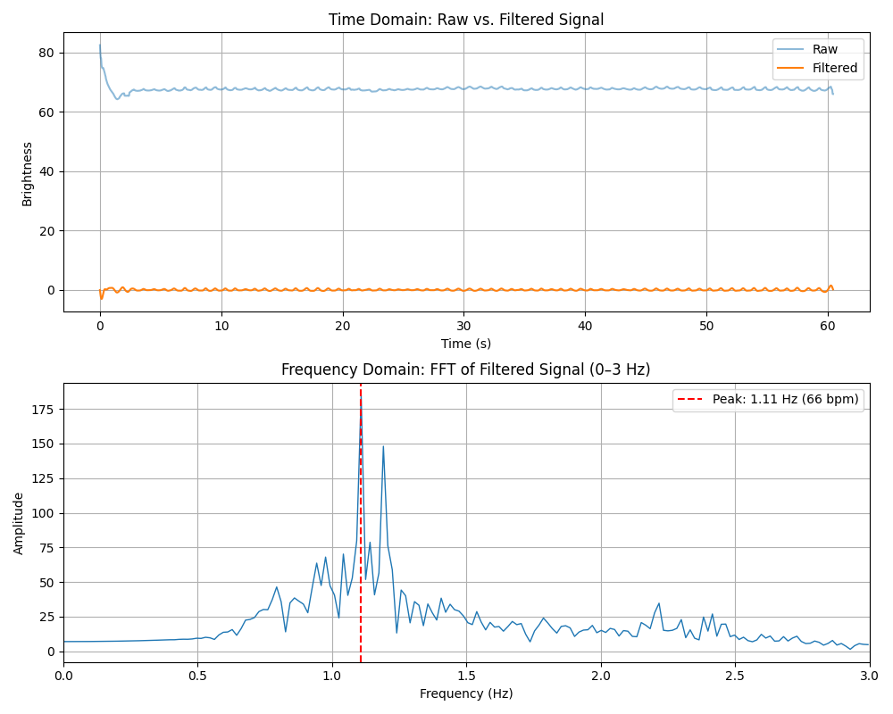

# PPG-Based Heart Rate Detection

This repository contains tools for photoplethysmography (PPG) based heart rate detection using smartphone videos. The system processes video data of a fingertip placed on a smartphone camera to extract heart rate measurements.

## Table of Contents
- [Setup](#setup)
- [Workflow](#workflow)
- [Apple Watch Reference Data](#apple-watch-reference-data)
- [Results](#results)
- [Conclusion](#conclusion)
- [Data Storage](#data-storage)

## Setup

### Prerequisites
- Python 3.6 or higher
- Git

### Installation

1. Clone this repository:
```bash
git clone https://github.com/seanzero7/PPG-Based-Heart-Rate-Detection.git
cd PPG-Based-Heart-Rate-Detection
```

2. Create and activate a virtual environment:

**macOS/Linux:**
```bash
python3 -m venv .venv
source .venv/bin/activate
```

**Windows:**
```bash
python -m venv .venv
.venv\Scripts\activate
```

3. Install dependencies:
```bash
pip install -r requirements.txt
```

## Workflow

### 1. Extract Raw Signal from Video

Record a video of your fingertip against your smartphone's camera with the flash enabled. The video should be at least 30-60 seconds long. 

Process the video to extract brightness values:

```bash
python RawSignal.py MOV/your_video.MOV --plot
```

This will:
- Extract the green channel values from each frame
- Calculate the mean brightness of each frame
- Save the data to a CSV file in the CSVs/ directory
- Display a plot of the raw signal if the `--plot` flag is used

### 2. Perform FFT Analysis

Analyze the raw signal using Fast Fourier Transform to identify frequency components:

```bash
python FFTScript.py
```

Note: You may need to modify the CSV filename in the script to match your data file.

The FFT will likely show noise along with the heart rate signal. The highest peak in the 0-3 Hz range represents the estimated heart rate.

### 3. Apply Filter for Improved Results

Apply a Butterworth bandpass filter to clean the signal:

```bash
python FilterScript.py
```

The FilterScript:
- Applies a bandpass filter in the range of 40-180 BPM (0.67-3 Hz)
- Performs FFT on the filtered signal
- Displays both the time-domain and frequency-domain representations
- Identifies the peak frequency and converts it to BPM

This filtered approach provides a much clearer heart rate estimation by removing noise outside the expected heart rate range.

## Apple Watch Reference Data

The `AppleWatchSignals` directory contains reference heart rate data collected from an Apple Watch. These files represent manually recorded heart rate changes observed on an Apple Watch over a 60-second period.

Each file contains:
- Comments showing heart rate values and the second at which they were observed
- A Python script that creates a vector representing the heart rate at each second

Example format:
```python
# 91 to 8    # Heart rate 91 BPM observed until second 8
# 90 to 13   # Heart rate changed to 90 BPM, observed until second 13
```

To collect similar reference data:
1. Wear an Apple Watch while recording your video
2. Note the heart rate displayed and the second at which it changes
3. Create a segments list with pairs of (heart_rate, end_second)

This reference data is useful for validating the accuracy of our PPG-based detection.

## Results

Below are the filtered FFT results from our PPG-based heart rate detection compared with Apple Watch reference measurements:

### Ben

Apple Watch Average: 89.53 BPM

### Rachel

Apple Watch Average: 71.15 BPM

### Sean

Apple Watch Average: 62.37 BPM

### Hubert

Apple Watch Average: 56.23 BPM

### Logan

Apple Watch Average: 64.30 BPM

The filtered FFT plots show the frequency spectrum after applying our bandpass filter (40-180 BPM). The peak frequency, indicated by the red dashed line, represents the detected heart rate. The Apple Watch average values provide a reference for comparison and validation of our detection method.

## Conclusion

The comparison between our PPG-based heart rate detection and Apple Watch measurements reveals a consistent pattern of small differences, typically within a few beats per minute. This close alignment validates our methodology while highlighting several interesting aspects of heart rate monitoring:

### Factors Contributing to Measurement Differences

1. **Measurement Location**  
   The Apple Watch measures heart rate at the wrist, while our system captures the PPG signal from the fingertip. These different anatomical locations experience slightly different blood flow dynamics.

2. **Temporal Averaging**  
   Apple Watch likely implements a rolling average algorithm to smooth heart rate variations over time, while our FFT analysis identifies the dominant frequency across the entire recording period.

3. **Sensing Technology**  
   Commercial devices like Apple Watch use specialized sensors optimized specifically for wearable PPG detection, whereas smartphone cameras are general-purpose optical sensors not originally designed for physiological measurements.

4. **Signal Processing Approaches**  
   Our simple but effective bandpass filter (40-180 BPM) demonstrates that relatively straightforward signal processing techniques can achieve results comparable to commercial devices with proprietary algorithms.

### Implications

The consistent proximity of our results to a commercial-grade device validates smartphone-based PPG as a viable approach for heart rate estimation. This opens possibilities for accessible heart rate monitoring in situations where specialized medical equipment is unavailable.

The small discrepancies between measurements remind us that physiological signals naturally contain variability, and different measurement approaches may each capture slightly different aspects of the same underlying phenomenon.

## Data Storage

The project uses the following directory structure for data management:

- `MOV/`: Contains the raw video files
- `CSVs/`: Stores the extracted brightness values as CSV files (t_sec, brightness)
- `RawSignals/`: May contain plots or additional data from the raw signal extraction
- `Filtered_FFTs/`: May contain the output plots from the filtered FFT analysis

When working with the code, make sure to:
1. Place your .MOV files in the MOV/ directory
2. Check that CSVs are being saved to the CSVs/ directory
3. Reference the correct CSV filename in the FFT and Filter scripts

The CSV files maintain a consistent format with two columns:
- `t_sec`: Time in seconds
- `brightness`: Mean green channel value

This allows for easy data sharing and consistent processing across different videos and subjects.
